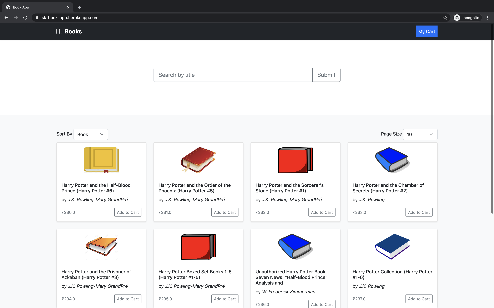
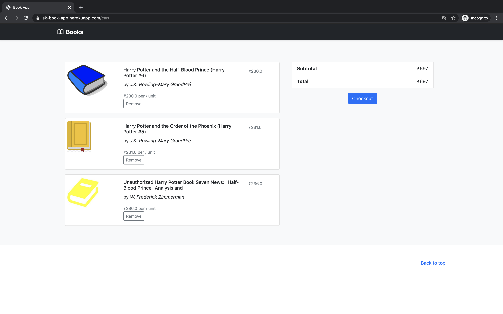
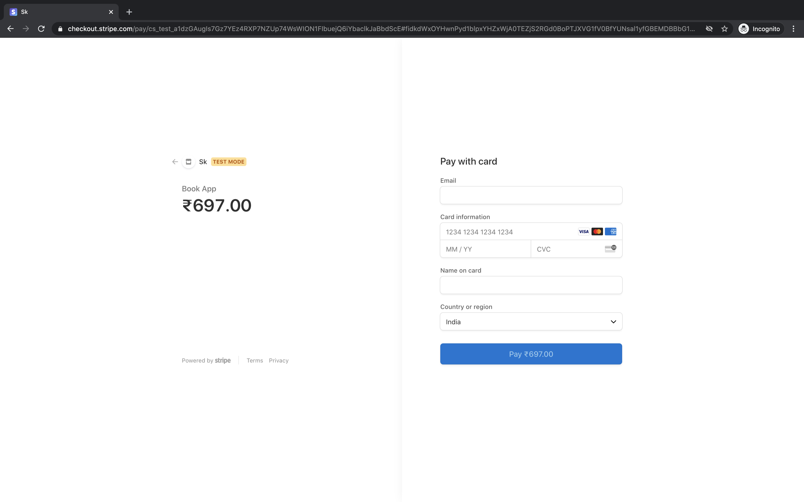
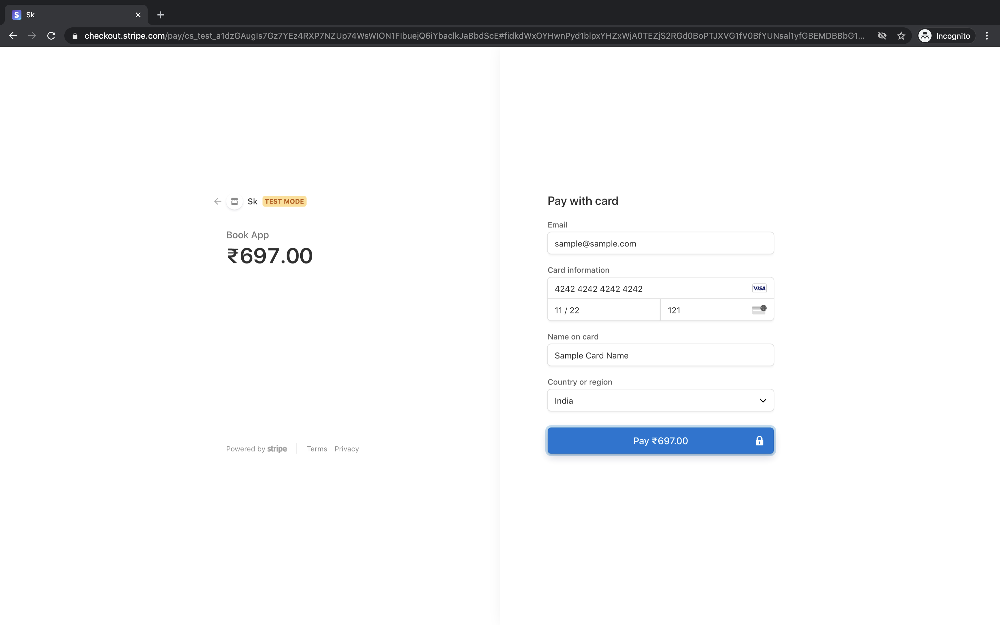
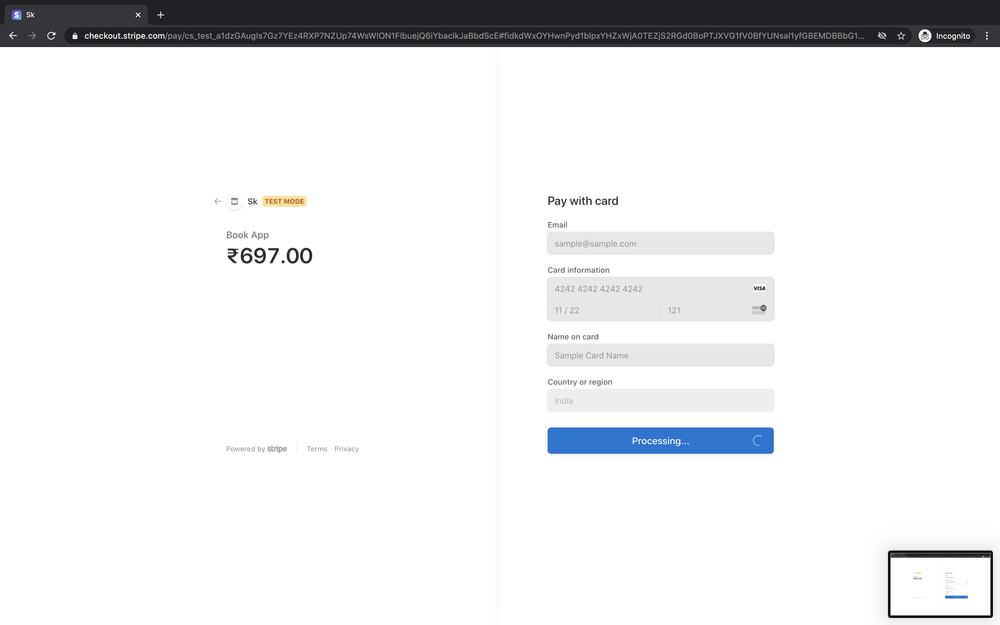
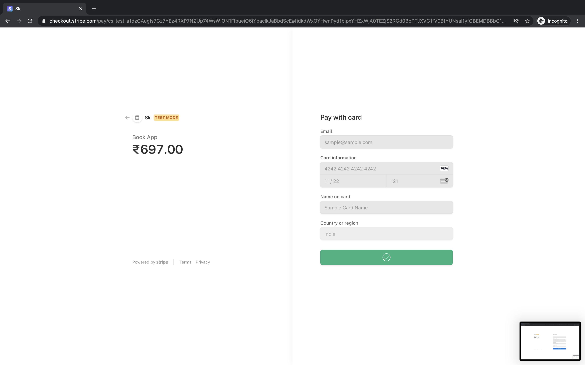
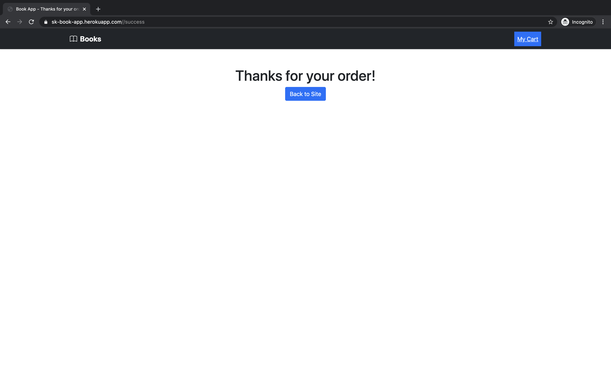

# book-app

- Spring boot with themeleaf 
- Stripe Integration
- Mysql DB

## Steps to Run

1. Checkout the code
2. Restore the [DB dump](db-schema-backup.sql)
3. run `mvn spring-boot:run`

## Screenshots

1. Home page

2. Cart page

3. Payment pages

4. Payment details entered.

5. Processing status.

6. Payment Completed

7. Order completion Page 

